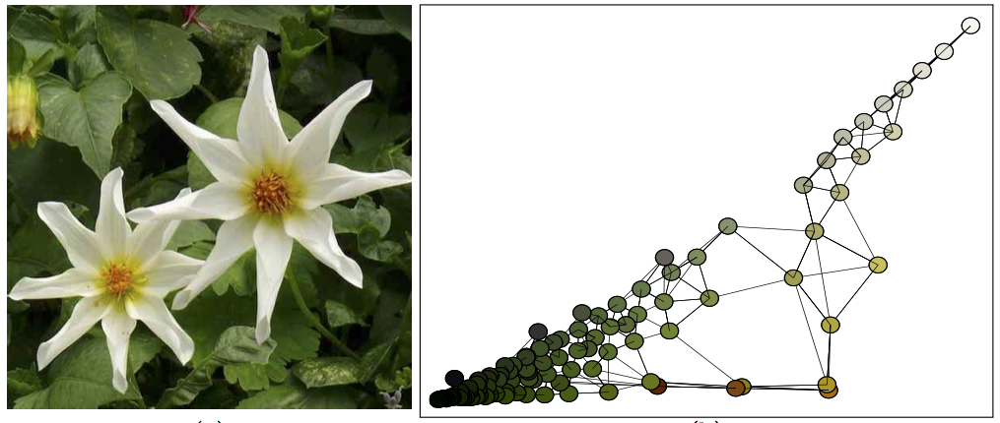

This toolbox contains the code code to reproduce the result of the article:

S. Ferradans, N. Papadakis, G. Peyré, J-F. Aujol. [Regularized Discrete Optimal Transport](https://arxiv.org/abs/1307.5551). SIAM Journal on Imaging Sciences, 7(3), pp. 1853–1882, 2014.

Copyright (c) S. Ferradans, N. Papadakis, G. Peyré, J-F. Aujol

==========================================
Installation

This code uses the Mosek library that can be download here: http://mosek.com/

Settings before executing the code:

* change the variable 'mosek_location' with the mosek path $PATH to the files :  
    - ./regularizedOT/load_mosek.m
	  - ./barycenter/frank_wolfe/load_mosek.m
* check that the Mosek license file is in the folder $PATH/6/toolbox/r2009b/   , if not add the path with the Mosek license file

==========================================
Relaxed and regularized OT

for its applications to color transfer: execute ./regularizedOT/compute_regularizedOT.m
apply regularized and relaxed OT on a cloud of points: execute ./regularizedOT/compute_regularizedOT.m

==========================================
Relaxed and regularized barycenters

Apply to color histogram interpolation(color normalization): execute the file barycenter/applyBarycenter.m
